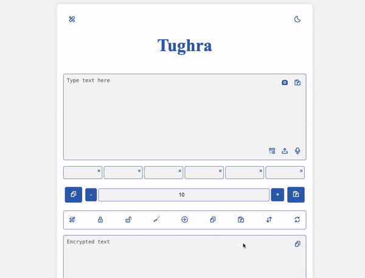

  <h1>Tughra Library Guide</h1>

The Tughra Library offers robust <b>End-to-End Encryption (E2EE)</b>, ensuring that data remains private and secure from the point it leaves the sender to the moment it reaches the intended recipient. With E2EE, data is encrypted on the sender's device, transmitted as unreadable ciphertext, and decrypted only by the authorized recipient, meaning no intermediaries (such as service providers or unauthorized third parties) can access the plaintext data during transit. This design is crucial for safeguarding sensitive information, as it prevents unauthorized access at any stage of data transmission. Tughra’s implementation of E2EE leverages advanced algorithms and customizable encryption cycles, allowing developers to configure secure, high-performance encryption processes directly into their applications.

  <h2>1. Overview</h2>
  
The Tughra Library offers encryption methods such as Turgha,  Caesar, Vigenere, XOR, and custom options. With features like configurable encryption modes, base character sets, and custom keys, it provides a flexible solution for encryption and decryption.

<h2>Demo</h2>
  
Here’s a simple <a href="https://github.com/Mohanadhatip/TUGHRA/blob/main/demo.html">demo</a> of how to use the Tughra Library to encrypt and decrypt a message, files, images, audios, videos, and more.

  

  <h2>2. Getting Started</h2>
  
Initialize the Tughra library by creating an instance of the <code>Tughra</code> class.

 
Ensure you have the Tughra Library available in your project. You can either include it as a script or import it as a module in your JavaScript file.

<strong>Adding the Tughra Library Script</strong>

      
<strong>Installing via npm</strong>

    
You can also install the Tughra Library via npm. Run the following command in your terminal:

<pre> npm install tughra@1.0.1</pre>

If you have the tughra.js file locally, place it in the same directory as your HTML file or in a designated js folder. You can also include it from a CDN or UNPKG. Add the following <b>&lt;script&gt;</b> tags in the <b>&lt;head&gt;</b> section of your HTML file:

<pre>
&lt;!DOCTYPE html&gt;
&lt;html lang="en"&gt;
&lt;head&gt;
  &lt;meta charset="UTF-8"&gt;
  &lt;meta name="viewport" content="width=device-width, initial-scale=1.0"&gt;
  &lt;title&gt;Tughra Library Guide&lt;/title&gt;

  &lt;!-- Link to Tughra Library (local file) --&gt;
  &lt;script src="tughra.js"&gt;&lt;/script&gt;

  &lt;!-- Link to Tughra Library (CDN) --&gt;
  &lt;script src="https://cdn.jsdelivr.net/npm/tughra@1.0.1/tughra.min.js"&gt; &lt;/script&gt;
  &lt;!-- Link to Tughra Library (UNPKG) --&gt;
  &lt;script src="https://unpkg.com/tughra@1.0.1/tughra.min.js"&gt; &lt;/script&gt;

  &lt;style&gt;
    /* Your CSS styling here */
  &lt;/style&gt;
&lt;/head&gt;
&lt;body&gt;
  &lt;!-- HTML content here --&gt;
&lt;/body&gt;
&lt;/html&gt;
</pre>

   

    
<strong>Initialize the Tughra object</strong>

    <pre>const tughra = new Tughra(mode, baseCharset, algorithm, encryptionKey, useBaseEncoding);</pre>
  

  

    
<strong>Example 1:</strong>

    <pre>const tughra = new Tughra('encrypt', 'ABCDEFGHIJKLMNOPQRSTUVWXYZ', 'caesar', 'myKey', false);</pre>
  

  

    
<strong>Example 2:</strong>

    <pre>
&lt;!DOCTYPE html&gt;
&lt;html lang="en"&gt;
&lt;head&gt;
  &lt;meta charset="UTF-8"&gt;
  &lt;meta name="viewport" content="width=device-width, initial-scale=1.0"&gt;
  &lt;title&gt;Tughra Library Guide&lt;/title&gt;

  &lt;!-- Link to Tughra Library --&gt;
  &lt;script src="tughra.js"&gt;&lt;/script&gt;

  &lt;!-- Link to Tughra Library (CDN) --&gt;
  &lt;script src="https://cdn.jsdelivr.net/npm/tughra@1.0.1/tughra.min.js"&gt; &lt;/script&gt;
  &lt;!-- Link to Tughra Library (UNPKG) --&gt;
  &lt;script src="https://unpkg.com/tughra@1.0.1/tughra.min.js"&gt; &lt;/script&gt;

  
  &lt;style&gt;
    /* Your CSS styling here */
  &lt;/style&gt;
&lt;/head&gt;
&lt;body&gt;
  &lt;!-- HTML content here --&gt;
  &lt;div class="container"&gt;
    &lt;h1&gt;Tughra Encryption Demo&lt;/h1&gt;  
    &lt;label for="inputText"&gt;Enter Text to Encrypt:&lt;/label&gt;
    &lt;input type="text" id="inputText" placeholder="Type something..."&gt;
    &lt;button onclick="encryptText()"&gt;Encrypt Text&lt;/button&gt;
    &lt;h2&gt;Encrypted Result:&lt;/h2&gt;
    &lt;p id="encryptedOutput"&gt;Your encrypted text will appear here.&lt;/p&gt;
  &lt;/div&gt;
  &lt;!-- JavaScript for Tughra library --&gt;
&lt;script&gt;
// Initialize the Tughra library and add encryption function
document.addEventListener('DOMContentLoaded', function () {
  const tughra = new Tughra('encrypt', 'ABCDEFGHIJKLMNOPQRSTUVWXYZ', 'caesar', 'myKey');
  window.encryptText = function () {
    const inputText = document.getElementById('inputText').value;
    if (inputText) {
      const encryptedText = tughra.process(inputText, 3); // Adjust cycles as needed
      document.getElementById('encryptedOutput').innerText = encryptedText;
    } else {
      document.getElementById('encryptedOutput').innerText = 'Please enter text to encrypt.';
    }
  };
});
&lt;/script&gt;
&lt;/body&gt;
&lt;/html&gt;
    </pre>
  

  <h2>3. Configuring the Library</h2>
  

    <h3>3.1 Mode</h3>
    
Set the mode to either <code>encrypt</code> or <code>decrypt</code>. The default mode is <code>encrypt</code>.

  

  

    <h3>3.2 Base Charset</h3>
    
The <code>baseCharset</code> parameter defines the set of characters for encoding, e.g., Base64 or a custom set.

  

  

    <h3>3.3 Algorithm</h3>
    
Choose an encryption algorithm like <code>Tughra</code>, <code>caesar</code>, <code>vigenere</code>, <code>XOR</code>,
     <code>ROT47</code>, 
      <code>Substitution</code>, 
       <code>Base64</code>, 
        <code>ASCII Shift</code>, 
         <code>Unicode Shift</code>, 
          <code>Numeric</code>, 
           <code>Reversed Caesar</code>, 
            <code>ROT13</code>, 
             <code>ROT18</code>, 
             <code>ROT25</code>, 
             <code>XOR Pro</code>, 
             <code>Affine Pro</code>, 
             <code>Substitution Pro</code>, 
    <code>ROT30</code>, <code>Affine</code>, or <code>Atbash</code>.

    
<b>Note:</b> some algorithm support only latin 1 group, but Tughra algorithm support all groups around the world.

  

  <h2>4. Processing Text</h2>
  
Use the <code>process</code> method to encrypt or decrypt text, specifying the number of cycles and the input text.

  

    
<strong>Example:</strong>

    <pre>const encryptedText = tughra.process("Hello, World!", 3);</pre>
  

  <h2>5. Error Handling</h2>
  
If the encryption key doesn't meet the required strength, an error will be thrown. Ensure keys meet the minimum length requirement.

  <h2>6. Advanced Features</h2>
  

    <h3>6.1 Custom Algorithms</h3>
    
Tughra supports advanced algorithms like <code>Affine Pro</code> and <code>Substitution Pro</code> for enhanced encryption.

  

  <h2>7. Additional Functions</h2>
  <h3>Auto-Generate Key Offsets</h3>
  
Use the <code>generateKey</code> function to create key offsets:

  <pre>const tughra = new TughraLibrary(); // Adjust to your class instance
const keyOffsets = tughra.generateKey(5, 'Basic Latin');</pre>

  <h3>Cycle Adjustment</h3>
  
Cycles can be adjusted dynamically using buttons in the interface or by specifying them directly in the method call.

  <h3>Character-Type Preservation</h3>
  
Tughra maintains the character type of input text, preserving the format across languages:

  <pre>const encryptedText = tughra.process("Hello", cycles);</pre>

  <h3>Base64 Encoding/Decoding for Files</h3>
  
For applications needing Base64 handling set useBaseEncoding to true:

  <pre>const tughra = new Tughra('encrypt', 'ABCDEFGHIJKLMNOPQRSTUVWXYZ', 'caesar', 'myKey', <strong>true</strong>);
const encryptedText = tughra.process("Hello, World!", 3);
const decryptedText = tughra.process(encryptedText, 3);</pre>

  <h2>Usage Cases</h2>
  <ul>
        <li><strong>Secure Data Transmission:</strong> Encrypt messages and files before sending them over insecure channels to protect sensitive information from eavesdroppers.</li>
        <li><strong>Data Storage Security:</strong> Encrypt data stored in databases or file systems to prevent unauthorized access and ensure data privacy.</li>
        <li><strong>File Encryption:</strong> Support for encrypting and decrypting files of all types, ensuring that sensitive documents are protected from unauthorized access.</li>
        <li><strong>Educational Tool:</strong> Demonstrate and explore cryptographic techniques and algorithms for learning purposes.</li>
        <li><strong>Password Management:</strong> Safely encrypt and store user passwords or sensitive credentials.</li>
    </ul>
  <h2>Important Note</h2>
  

    
<strong>Note:</strong> The Tughra method requires the correct <code>keyOffsets</code> and <code>cycles</code> for decryption. Retain these values to prevent data loss.

  

    
The Tughra Encryption System provides superior protection through the use of encryption techniques based on random keys and multiple rounds of encryption, making it suitable for various fields and uses. Here is a comprehensive list of areas where this system can be beneficial:

    

        <h2>Contents</h2>
        <a href="#section1">1. Protecting Personal Data</a> 
        <a href="#section2">2. Securing Communications</a> 
        <a href="#section3">3. Securing Digital Content</a> 
        <a href="#section4">4. E-Commerce</a> 
        <a href="#section5">5. Securing Applications and Software</a> 
        <a href="#section6">6. Identity Verification</a> 
        <a href="#section7">7. Securing Systems and Networks</a> 
        <a href="#section8">8. Cloud Storage</a> 
        <a href="#section9">9. Protecting Software</a> 
        <a href="#section10">10. Protecting Data in the Internet of Things (IoT)</a> 
        <a href="#section11">11. Protecting Financial Data</a> 
        <a href="#section12">12. Digital Forensics</a> 
        <a href="#section13">13. Scientific and Academic Research</a> 
        <a href="#section14">14. Encryption in Video Games</a> 
        <a href="#section15">15. Securing Educational Institutions</a> 
        <a href="#section16">16. Legal Transactions and Electronic Contracts</a> 
        <a href="#section17">17. E-Government Systems</a> 
        <a href="#section18">18. Secure Email Services</a> 
        <a href="#section19">19. Protecting Media and Journalistic Content</a> 
        <a href="#section20">20. Logistics and Supply Chains</a> 
        <a href="#section21">21. Creating Cryptocurrency</a> 
        <a href="#section22">22. Secure Electronic Voting System</a> 
        <a href="#section23">23. Decentralized Cloud Computing</a> 
        <a href="#section24">24. Securing Decentralized Digital Trade Platforms (DeFi)</a> 
        <a href="#section25">25. Digital Rights Management (DRM)</a> 
        <a href="#section26">26. Securing Financial Systems for Major Corporations</a> 
        <a href="#section27">27. Advanced IoT Systems</a> 
        <a href="#section28">28. Next-Generation Digital Infrastructure Systems (5G)</a> 
        <a href="#section29">29. Managing Sensitive Documents for Multinational Corporations</a> 
        <a href="#section30">30. Data Transfer Between Drones</a> 
        <a href="#section31">31. Securing Military Communications</a> 
        <a href="#section32">32. Protecting Government Networks</a> 
        <a href="#section33">33. Weapons Management Systems</a> 
        <a href="#section34">34. Protecting Data in Travel</a> 
    
  
    

        <h2>1. Protecting Personal Data</h2>
        
• Encrypting medical records and sensitive health data. 
        • Protecting banking information such as account numbers and passwords. 
        • Encrypting personal identification information (such as electronic passports).

    

    

        <h2>2. Securing Communications</h2>
        
• Encrypting text messages and emails. 
        • Securing voice and video calls over the internet. 
        • Protecting conversations in messaging apps like WhatsApp or Telegram.

    

    

        <h2>3. Securing Digital Content</h2>
        
• Encrypting digital images and videos to prevent piracy. 
        • Protecting paid digital content such as e-books or movies. 
        • Securing design files and creative works.

    

    

        <h2>4. E-Commerce</h2>
        
• Encrypting electronic payment data, such as credit card information. 
        • Protecting customer data and online business transactions. 
        • Securing purchases through e-commerce stores.

    

    

        <h2>5. Securing Applications and Software</h2>
        
• Encrypting data within banking and business applications. 
        • Protecting data exchanged between application servers and users. 
        • Securing information stored in application databases.

    

    

        <h2>6. Identity Verification</h2>
        
• Encrypting identity data during online authentication processes. 
        • Protecting fingerprints or other biometric data. 
        • Securing identity verification processes through electronic payment platforms.

    

    

        <h2>7. Securing Systems and Networks</h2>
        
• Encrypting data exchanged between devices within the network. 
        • Protecting networks from cyberattacks such as malware. 
        • Securing communications within major enterprise networks.

    

    

        <h2>8. Cloud Storage</h2>
        
• Encrypting files and information stored on cloud services like Google Drive. 
        • Protecting data during transfer between devices and the cloud. 
        • Securing cloud data from breaches or leaks.

    

    

        <h2>9. Protecting Software</h2>
        
• Encrypting software code to prevent tampering or theft. 
        • Protecting intellectual property rights for computer programs and applications. 
        • Securing software applications from external attacks.

    

    

        <h2>10. Protecting Data in the Internet of Things (IoT)</h2>
        
• Encrypting data sent and received between IoT devices. 
        • Securing smart control systems within homes and businesses. 
        • Protecting communications between sensors and smart vehicles.

    

    

        <h2>11. Protecting Financial Data</h2>
        
• Encrypting financial data exchanged between banks and financial institutions. 
        • Securing electronic payment transactions and bank transfers. 
        • Protecting online bank accounts from breaches.

    

    

        <h2>12. Digital Forensics</h2>
        
• Using encryption to secure digital evidence. 
        • Protecting information gathered during digital forensic investigations. 
        • Securing storage of sensitive criminal data.

    

    

        <h2>13. Scientific and Academic Research</h2>
        
• Encrypting data and research information to prevent tampering or theft. 
        • Protecting academic research and scientific papers from breaches. 
        • Securing communication between researchers while sharing sensitive information.

    

    

        <h2>14. Encryption in Video Games</h2>
        
• Protecting players' personal data within games. 
        • Encrypting financial transactions within digital games. 
        • Securing game servers from cyberattacks.

    

    

        <h2>15. Securing Educational Institutions</h2>
        
• Encrypting sensitive information for students such as academic records. 
        • Securing data exchanged through e-learning platforms. 
        • Protecting online exams from cheating or tampering.

    

    

        <h2>16. Legal Transactions and Electronic Contracts</h2>
        
• Encrypting electronic contracts to ensure their integrity. 
        • Protecting sensitive legal data during online transactions. 
        • Securing electronic signatures and confirmations.

    

    

        <h2>17. E-Government Systems</h2>
        
• Encrypting citizen data within government databases. 
        • Securing online transactions and e-government services. 
        • Protecting communications between government agencies.

    

    

        <h2>18. Secure Email Services</h2>
        
• Encrypting emails to ensure privacy and confidentiality. 
        • Protecting email exchanges from hackers and breaches. 
        • Securing communications for sensitive topics.

    

    

        <h2>19. Protecting Media and Journalistic Content</h2>
        
• Encrypting journalistic materials and reports. 
        • Protecting news organizations from cyberattacks. 
        • Securing communications with sources.

    

    

        <h2>20. Logistics and Supply Chains</h2>
        
• Encrypting data exchanged between suppliers and distributors. 
        • Securing communications in logistics systems. 
        • Protecting sensitive information about shipments.

    

    

        <h2>21. Creating Cryptocurrency</h2>
        
• Encrypting wallet keys to protect cryptocurrency. 
        • Securing transactions within cryptocurrency systems. 
        • Protecting user identities in cryptocurrency trading.

    

    

        <h2>22. Secure Electronic Voting System</h2>
        
• Encrypting voting data to ensure integrity and security. 
        • Protecting voter identities and choices. 
        • Securing communications within electronic voting systems.

    

    

        <h2>23. Decentralized Cloud Computing</h2>
        
• Encrypting data within decentralized cloud systems. 
        • Protecting user data in decentralized networks. 
        • Securing transactions and communications in cloud platforms.

    

    

        <h2>24. Securing Decentralized Digital Trade Platforms (DeFi)</h2>
        
• Encrypting transactions within decentralized finance systems. 
        • Protecting user identities and financial information. 
        • Securing smart contracts and transactions.

    

    

        <h2>25. Digital Rights Management (DRM)</h2>
        
• Encrypting digital content to protect intellectual property rights. 
        • Securing licensing and access controls. 
        • Protecting copyrighted material.

    

    

        <h2>26. Securing Financial Systems for Major Corporations</h2>
        
• Encrypting data within corporate finance systems. 
        • Protecting sensitive financial information from breaches. 
        • Securing transactions and communications between financial systems.

    

    

        <h2>27. Advanced IoT Systems</h2>
        
• Encrypting data exchanged between advanced IoT devices. 
        • Protecting smart city infrastructure. 
        • Securing communications between smart systems.

    

    

        <h2>28. Next-Generation Digital Infrastructure Systems (5G)</h2>
        
• Encrypting data within 5G networks. 
        • Protecting communications and transactions in real-time. 
        • Securing connections between devices and networks.

    

    

        <h2>29. Managing Sensitive Documents for Multinational Corporations</h2>
        
• Encrypting sensitive documents and files. 
        • Protecting internal communications and transactions. 
        • Securing collaborations between multinational teams.

    

    

        <h2>30. Data Transfer Between Drones</h2>
        
• Encrypting data exchanged between drones and control systems. 
        • Protecting data collected during drone flights. 
        • Securing communications between multiple drones.

    

    

        <h2>31. Securing Military Communications</h2>
        
• Encrypting military data and communications. 
        • Protecting sensitive military information from breaches. 
        • Securing connections between military systems.

    

    

        <h2>32. Protecting Government Networks</h2>
        
• Encrypting data within government networks. 
        • Protecting sensitive information from cyberattacks. 
        • Securing communications between government agencies.

    

    

        <h2>33. Weapons Management Systems</h2>
        
• Encrypting data exchanged within weapons systems. 
        • Protecting sensitive military data. 
        • Securing communications related to military operations.

    

        <h2>34. Protecting Data in Travel</h2>
        
• Encrypting travel documents and itineraries. 
        • Protecting sensitive information shared during travel. 
        • Securing communications related to travel arrangements.

    

    <strong>Tughra</strong> is a developing system that relies on multiple factors that make the decryption process extremely difficult if the person does not have the used fields (character and symbol set) and the number of cycles (frequency). Let’s illustrate the complexity of the decryption process:

<ol>
    <li>
        <strong>Fields (Character Set):</strong>
        <ul>
            <li>
                If you have about 144,300 characters or symbols, and you are using a random set of these characters to encrypt the text, this adds significant complexity. Each character in the original text could be replaced by a variety of substitutes, making it very difficult to reconstruct the original text without knowing the fields exactly.
            </li>
        </ul>
    </li>
    <li>
        <strong>Number of Cycles (Frequency):</strong>
        <ul>
            <li>
                Adding a non-fixed number of cycles greatly increases the complexity of the encryption. If the encryption is done for a random number of cycles, hackers will have countless attempts to determine the correct number of cycles.
            </li>
        </ul>
    </li>
    <li>
        <strong>Brute Force Attack:</strong>
        <ul>
            <li>
                Theoretically, any encryption system can be subjected to a brute force attack (trying all possible combinations). However, considering the large number of fields and variable cycles, attempting all combinations would take an enormous amount of time. The more fields and cycles increase, the more the difficulty multiplies significantly.
            </li>
        </ul>
    </li>
    <li>
        <strong>Complexity of Calculations:</strong>
        <ul>
            <li>
                Assuming you have an unlimited number of fields and an unlimited number of cycles, the number of possible decryption combinations would be so huge that no modern computer system could handle it in a reasonable time frame. Additionally, if these fields are unknown, the hacker won’t be able to make any logical attempts to decrypt, making the process akin to finding a needle in a haystack.
            </li>
        </ul>
    </li>
</ol>
<h2>Expected Time for Decryption:</h2>

    If a hacker programs an automated code to attempt decryption using a brute force attack, the time required depends on several factors, including:

<ul>
    <li>The power of the computers used by the hacker.</li>
    <li>The number of fields used.</li>
    <li>The number of cycles.</li>
    <li>The strength of the random algorithm used to determine the alternative fields.</li>
</ul>

    The larger the number of fields and cycles, the exponentially greater the time required. With large numbers of fields and cycles, the decryption process could reach billions or even trillions of attempts, which means it could take thousands of years or more, depending on the available computing power.

  <h2>Conclusion</h2>
  
The Tughra library provides a robust encryption solution for text and files, ideal for data security and cryptographic exploration. Without knowing the fields exactly and the number of cycles, decryption using an automated attack would be nearly impossible within a reasonable timeframe.

  
For more information, visit the <a href="https://github.com/Mohanadhatip/TUGHRA/" target="_blank">Tughra GitHub page</a>.

